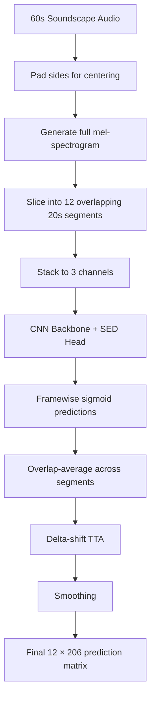
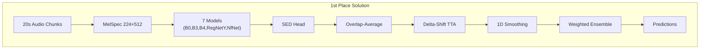

# 🔍 BirdCLEF Project — Full Codebase Analysis

## Project Overview

This project tackles **BirdCLEF 2025**: identifying 206 bird/insect/amphibian species from noisy 60-second soundscape recordings. The project contains two key notebooks and several supporting documents.

### Repository Structure

| File | Purpose |
|---|---|
| [species-identification-in-noisy-soundscapes.ipynb](file:///Users/niloydas/Desktop/Niloy%20Folder/Machine-Learning-Project-BirdCLEF-/species-identification-in-noisy-soundscapes.ipynb) | **Your notebook** — the main training & inference pipeline |
| [birdclef2025-1st-place-inference.ipynb](file:///Users/niloydas/Desktop/Niloy%20Folder/Machine-Learning-Project-BirdCLEF-/birdclef2025-1st-place-inference.ipynb) | **1st-place reference** — inference-only notebook from the winning solution |
| [Solution_Overview.txt](file:///Users/niloydas/Desktop/Niloy%20Folder/Machine-Learning-Project-BirdCLEF-/Solution_Overview.txt) | Detailed write-up of the 1st-place winner's methodology |
| [ISSUES_AND_FIXES.md](file:///Users/niloydas/Desktop/Niloy%20Folder/Machine-Learning-Project-BirdCLEF-/ISSUES_AND_FIXES.md) | Diagnosis of why baseline training failed |
| [ACTION_PLAN.md](file:///Users/niloydas/Desktop/Niloy%20Folder/Machine-Learning-Project-BirdCLEF-/ACTION_PLAN.md) | Action items for improving the model |
| [README.md](file:///Users/niloydas/Desktop/Niloy%20Folder/Machine-Learning-Project-BirdCLEF-/README.md) | Project documentation (cell-by-cell walkthrough) |

---

## Your Notebook Analysis

Your notebook ([species-identification-in-noisy-soundscapes.ipynb](file:///Users/niloydas/Desktop/Niloy%20Folder/Machine-Learning-Project-BirdCLEF-/species-identification-in-noisy-soundscapes.ipynb)) follows a **two-pipeline architecture**:

### Pipeline 1: Basic (Cells 1–6) — Visualization & Benchmarking
- **5-second** audio chunks, **128** mel bands, n_fft=1024
- Used for spectrogram generation, visualization, and baseline dataset creation

### Pipeline 2: SED (Cells 7–10) — Training & Evaluation
- **20-second** audio chunks, **224** mel bands, n_fft=4096, hop_length=1252
- Produces (224 × 512) spectrograms matching the 1st-place config
- Uses `tf_efficientnet_b3.ns_jft_in1k` backbone

### Cell-by-Cell Breakdown

| Cell | Purpose | Status |
|---|---|---|
| 1 | Install `timm` | ✅ Complete |
| 2 | Config & imports (dual pipeline: Basic + SED) | ✅ Complete |
| 3 | Load metadata + species distribution visualization | ✅ Complete |
| 4 | Pre-generate & save all spectrograms (Basic pipeline, 128-mel, PNG) | ✅ Complete (~22 min) |
| 5 | `BirdCLEFDataset` class with auto-detect of pre-saved spectrograms | ✅ Complete |
| 6 | Helper functions (Mixup, SpecAugment, WeightedSampler, ImprovedBirdDataset) | ✅ Complete |
| 7 | SED Model Architecture (`BirdCLEFSED`) | ✅ Complete |
| 8 | SED Training Loop | ✅ Complete |
| 9 | Overlap-Average Inference (soundscape-level) | ✅ Complete |
| 10 | Generate submission.csv | ✅ Complete |

### Key Techniques Implemented

| Technique | Your notebook | 1st-place |
|---|---|---|
| SED Architecture (AttHead + GeMFreq pooling) | ✅ | ✅ |
| EfficientNet-B3 backbone | ✅ | ✅ (+ B0, B4, RegNetY, NFNet) |
| 20-sec input chunks | ✅ | ✅ |
| 224 mel bands, n_fft=4096 | ✅ | ✅ |
| Z-score + min-max normalization | ✅ | ✅ ("default" normalization) |
| Mixup augmentation | ✅ | ✅ |
| SpecAugment (time/freq masking) | ✅ | ❌ (not explicitly in their solution) |
| Weighted sampling | ✅ | ✅ |
| Label smoothing | ✅ | ❌ (they use plain CE) |
| Cosine annealing LR scheduler | ✅ | ✅ (CosineAnnealingWarmRestarts) |
| Overlap-average inference | ✅ | ✅ |
| Smoothing post-processing | ❌ | ✅ |
| Delta-shift TTA | ❌ | ✅ |
| Multi-model ensemble | ❌ | ✅ (7 models) |
| Pseudo-labeling / Self-training | ❌ | ✅ (4 iterations) |
| Stochastic Depth (drop_path) | ❌ | ✅ |
| Separate model for Insecta/Amphibia | ❌ | ✅ |
| OpenVINO inference optimization | ❌ | ✅ |

---

## 1st-Place Reference Notebook Analysis

The reference notebook ([birdclef2025-1st-place-inference.ipynb](file:///Users/niloydas/Desktop/Niloy%20Folder/Machine-Learning-Project-BirdCLEF-/birdclef2025-1st-place-inference.ipynb)) is **inference-only** — it loads pre-trained models and generates predictions. It does **not** contain training code.

### Architecture



### Key Components

#### `CLEFClassifierSED` — Model Architecture
- **`SpecFeatureExtractor`**: MelSpectrogram → AmplitudeToDB → Normalization (z-score + min-max)
- **Backbone**: `timm` CNN (e.g. `tf_efficientnet_b3.ns_jft_in1k`), `features_only=True` — extracts feature maps without classifier
- **`AttHead`**: GeMFreq pooling → Dense (512 hidden) → 1×1 Conv for attention + framewise logits → Sigmoid
- Generates **framewise probabilities** (not just clip-level)

#### `InferenceDataset` — Data Pipeline
- Loads 60s soundscapes, normalizes with `librosa.util.normalize`
- **`full_signal` mode**: generates one giant mel-spectrogram, then slices — ensures consistent spectral features across segment boundaries
- Pads signal so first/last 5s segments are centered

#### `VINOEngine` — OpenVINO Optimization
- Converts PyTorch model → OpenVINO IR for CPU-optimized inference
- ~2×-3× speed improvement over PyTorch CPU inference

#### `get_head_preds` — Overlap-Average Inference
- Each 20s segment produces framewise predictions with `step = 5s worth of frames`
- Overlapping frames are **averaged** across neighboring segments
- **Delta-shift TTA**: predictions are also computed at ±2 frame offsets and blended (25%/50%/25% weighting)

#### Ensemble Configuration
7 models from different training stages:

| Model | Backbone | Training stage |
|---|---|---|
| 1 | `tf_efficientnet_b3` | 3rd self-training iteration |
| 2 | `regnety_016.tv2_in1k` | 4th self-training iteration |
| 3 | `regnety_008.pycls_in1k` | 1st stage (supervised) |
| 4 | `tf_efficientnet_b0` | Dedicated Insecta/Amphibia model (700 species) |
| 5 | `eca_nfnet_l0.ra2_in1k` | 3rd self-training iteration |
| 6 | `tf_efficientnet_b4` | 3rd self-training iteration |
| 7 | `regnety_016.tv2_in1k` | 4th self-training iteration |

Post-processing:
- Weighted ensemble: `[0.133, 0.166, 0.133, 0.133, 0.166, 0.133, 0.133]`
- 1D smoothing convolution: `[0.1, 0.2, 0.4, 0.2, 0.1]`

---

## Gap Analysis: Your Notebook vs 1st-Place

### 🟢 What You've Got Right
1. **SED architecture** with attention head and GeMFreq pooling — matches 1st place
2. **20-second input chunks** — the winning duration
3. **224 mel bands with 4096 n_fft** — exact same spectrogram config
4. **Overlap-average inference** — the key inference technique
5. **Mixup, weighted sampling, cosine LR** — solid training foundation

### 🔴 Critical Gaps (Largest Impact)

#### 1. No Pseudo-Labeling / Self-Training
> [!IMPORTANT]
> The 1st-place solution gets its biggest single boost from **Multi-Iterative Noisy Student** self-training. Public LB went from **0.872 → 0.930** through 4 pseudo-labeling iterations. This alone accounts for ~6% absolute improvement.

**What it does:** Use your trained model to label the unlabeled 60s soundscapes, then mix those pseudo-labeled samples with the training data via Mixup during subsequent training rounds.

#### 2. No Model Ensemble
The winning solution ensembles **7 models** across different architectures and training stages. A single-model solution will always be weaker.

#### 3. No Delta-Shift TTA
The 1st-place inference applies a ±2 frame temporal shift during inference and blends predictions (50% center + 25% left-shift + 25% right-shift). This is a free accuracy boost at inference time.

#### 4. No Smoothing Post-Processing
A 1D convolution `[0.1, 0.2, 0.4, 0.2, 0.1]` smooths predictions across time segments, reducing jitter.

#### 5. No Stochastic Depth
Adding `drop_path_rate=0.15` during self-training gave a consistent +0.005 LB boost.

### 🟡 Minor Gaps

| Gap | Impact |
|---|---|
| No separate Insecta/Amphibia model | +0.002–0.003 LB |
| No Xeno-Canto additional data | Variable |
| No OpenVINO optimization | Speed only (no accuracy impact) |
| Using AdamW vs plain Adam | Minor |
| Loss: Your notebook uses CE with label smoothing, 1st-place uses plain CE | Roughly equivalent |

---

## Actionable Recommendations (Priority Order)

### Phase 1: Quick Wins (No Retraining Required)

1. **Add delta-shift TTA** to your inference cell (Cell 9)
   - Shift the mel-spectrogram ±2 frames and blend predictions
   - Expected: +0.002–0.003

2. **Add 1D smoothing** to post-processing
   ```python
   from scipy.ndimage import convolve1d
   kernel = np.array([0.1, 0.2, 0.4, 0.2, 0.1])
   preds = convolve1d(preds, kernel, axis=0)
   ```

### Phase 2: Training Improvements

3. **Add Stochastic Depth** (`drop_path_rate=0.15`) to the EfficientNet backbone
   ```python
   self.backbone = timm.create_model(backbone_name, pretrained=True,
                                      features_only=True, drop_path_rate=0.15)
   ```

4. **Use CosineAnnealingWarmRestarts** instead of basic CosineAnnealingLR
   ```python
   scheduler = torch.optim.lr_scheduler.CosineAnnealingWarmRestarts(
       optimizer, T_0=5, eta_min=1e-6)
   ```

5. **Switch optimizer** to AdamW with weight_decay=1e-4

6. **Train longer** (25–35 epochs instead of 10)

### Phase 3: Self-Training Pipeline

7. **Implement pseudo-labeling**:
   - Use your best trained model to label the unlabeled soundscapes
   - Apply power transform to pseudo-labels (power=1.0 for iteration 1)
   - Use WeightedRandomSampler biased toward soundscapes with higher confidence
   - Mix labeled + pseudo-labeled data via Mixup (100% mixing ratio)
   - Train new models on this combined data
   - Repeat 3–4 iterations, increasing the power (1/0.65, 1/0.55, 1/0.6)

### Phase 4: Ensemble

8. **Train multiple architectures**: EfficientNet-B3, B4, RegNetY-016, RegNetY-008, NfNet-L0
9. **Ensemble their predictions** with weighted averaging

### Phase 5: Dedicated Group Models

10. **Train a separate EfficientNet-B0** on extended Insecta/Amphibia data from Xeno-Canto (700 species)

---

## Architecture Comparison Summary

````carousel

<!-- slide -->

````

---

## Key Takeaway

> [!TIP]
> Your notebook already has the **correct core architecture** (SED model, 20s chunks, 224 mel bands, overlap inference). The main performance gaps come from **scale** (ensemble, more epochs, self-training) rather than fundamental design. The foundation is solid — the next step is to layer on the advanced training techniques that took the 1st-place solution from ~0.87 to ~0.93.
